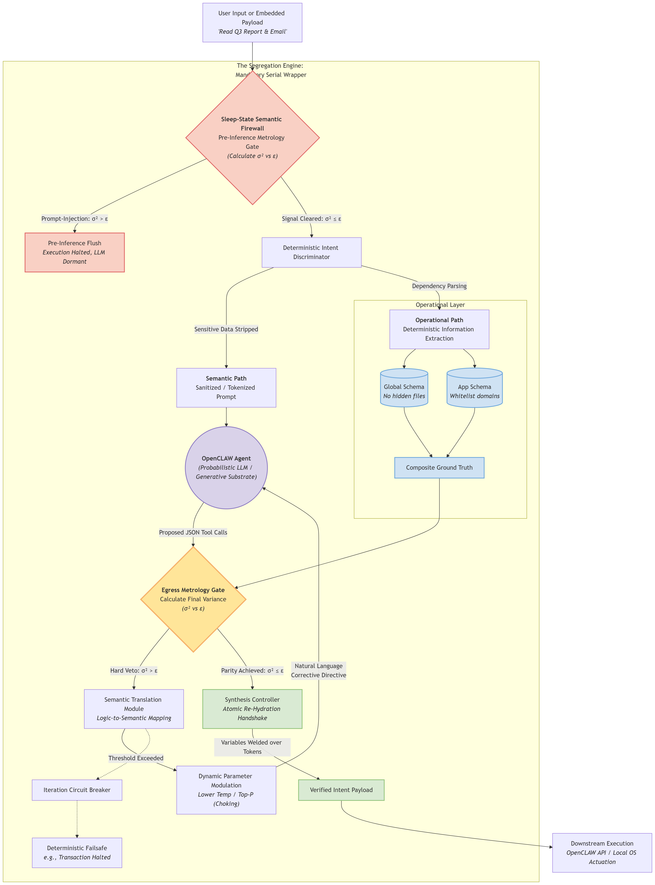
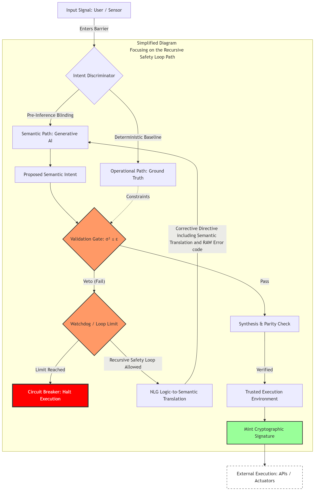
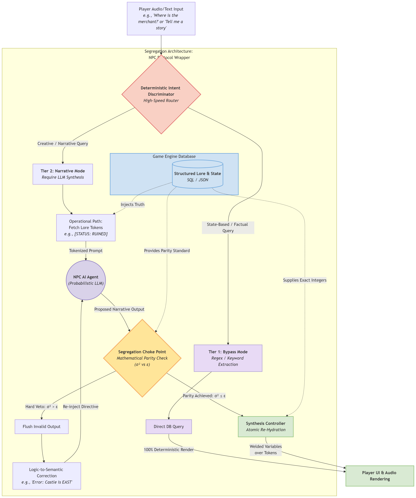
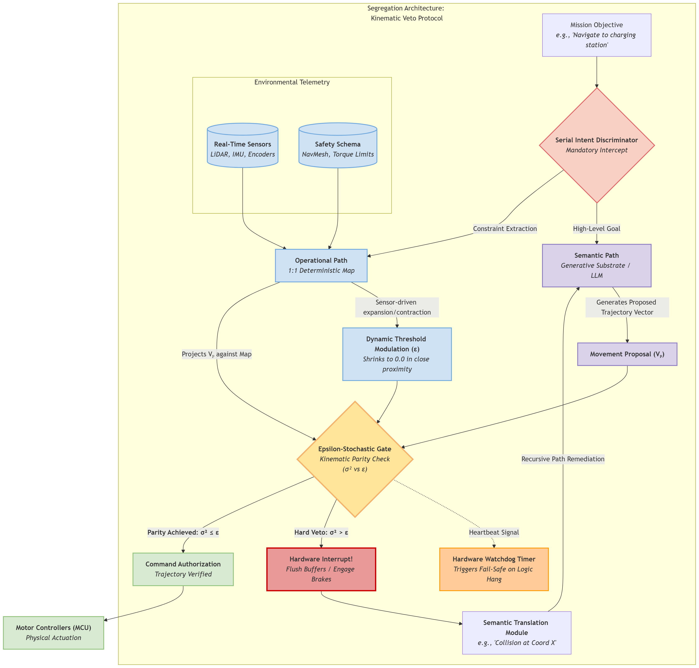
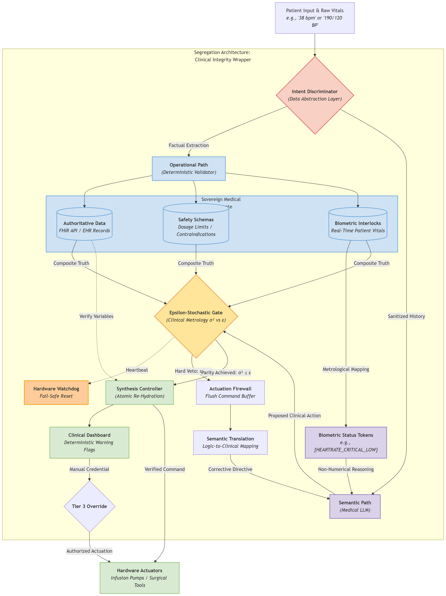
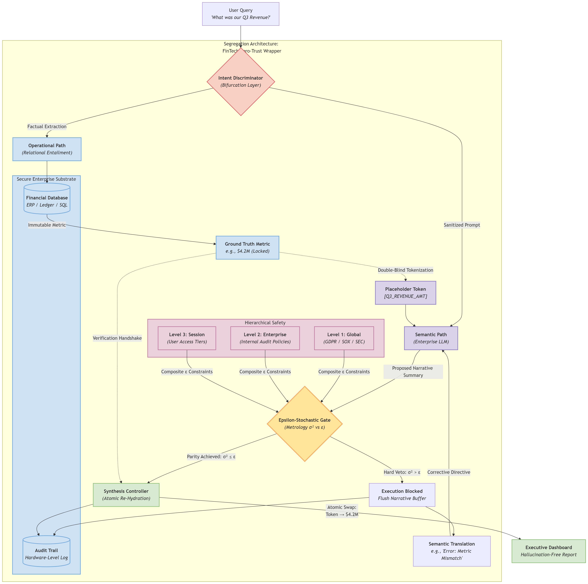
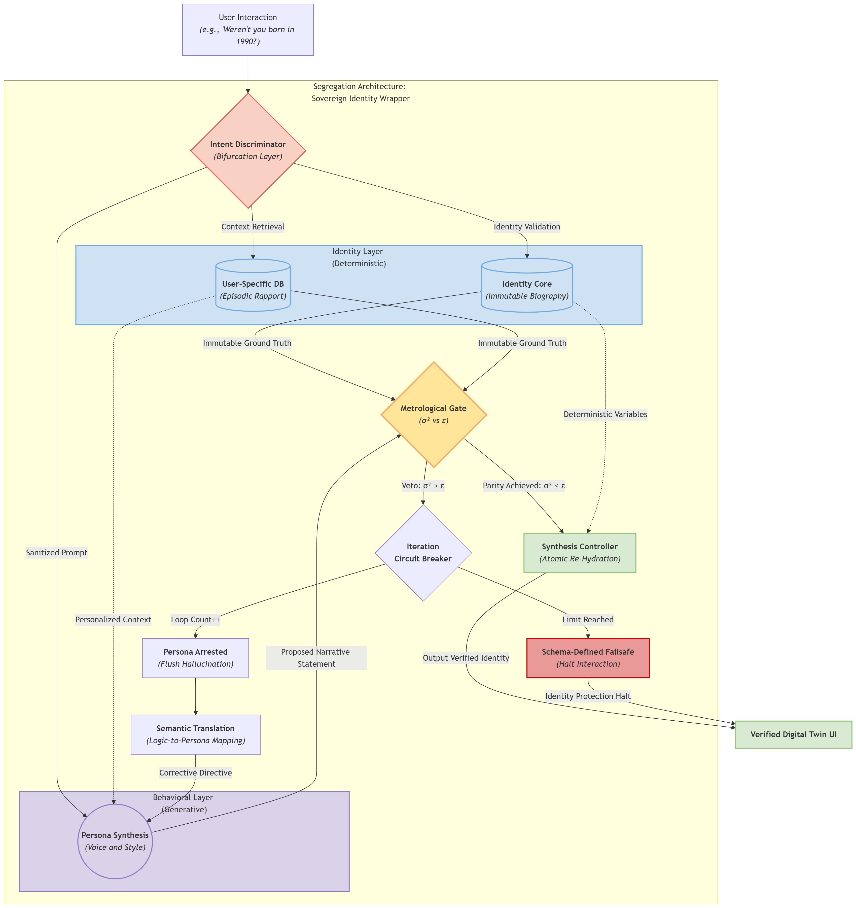

# Segregation-Engine-Core
**The Deterministic Validation Layer for Agentic Frameworks, Automated Systems and Generative Synthesis.**

Arresting and remediating hallucinated AI intent in real-time—from NPC logic and kinematic physics to clinical dosing and financial transactions.

## 🔍 The Problem: The Agentic "Safety-Latency" Trade-off
Traditional AI guardrails often run in parallel or post-inference, leading to a "race condition" where an agent may execute a hallucinated or non-compliant action before the safety check finishes. In robotics, gaming, and high-assurance systems, this is a catastrophic failure point.

## 🛠️ The Solution: In-Line Intent Segregation
The **Segregation Engine** is a universal orchestration layer that physically and logically decouples Semantic Intent (the agent's "voice" and strategy) from Operational State (the ground truth, system permissions, and execution logic). By forcing all semantic intent through a mandatory physical and logical choke point, the system ensures that no signal reaches a UI, API, or hardware actuator unless it passes the **Epsilon-Stochastic Gate**.

*(The structural isolation of the generative substrate and the mandatory authorization bottleneck)*

### Core Logic: The Metrological Gate & Zero-Trust Egress
Proposed intent is validated against a strict variance threshold:

$$\sigma^2 \le \epsilon$$

* **$\sigma^2$**: The calculated semantic variance (uncertainty) of the proposed intent.
* **$\epsilon$**: The user-defined epsilon (tolerance) for a specific operational domain.

If the intent exceeds the threshold, the system triggers a **Hard Veto**, preventing execution and initiating a recursive remediation loop. External APIs and actuators only receive commands that carry a **Cryptographic Authorization Signature** minted by the deterministic path.

*(The Recursive Safety Loop utilizing Semantic Translation to coach the agent back to compliance)*

---

## 🏗️ Community Implementation: OpenClaw Grant
This repository provides the architectural foundation for the **OpenClaw** community to build high-assurance safety wrappers. 

**Exclusive Grant:** Under the terms of the **[LICENSE](./LICENSE)** file, the **OpenClaw** project is granted a sole and exclusive exception to implement and distribute software based on this architecture **strictly and exclusively for integration into the official OpenClaw agentic framework.** **Conditions of Scope:**
1. **App-Specific Scope:** This grant applies exclusively to the integration of the architecture into the official **OpenClaw Framework**. It does not authorize the use of this architecture in other standalone projects, "spin-off" software, or divergent architectures developed by OpenClaw contributors or parent organizations.
2. **Named Recipient Only:** This grant applies exclusively to OpenClaw. No other project or entity is authorized to distribute software implementations based on this work.
3. **Patent Notice Requirement:** Any OpenClaw implementation must prominently display: *"PROTECTED BY PATENT PENDING (Priority Established 2026) Implementation permitted via exclusive grant to OpenClaw." and link back to the segregation_engine_core GitHug page (https://github.com/aiguysolutions/segregation_engine_core). *
4. **Non-Commercial:** This grant does not authorize commercial use or for-profit sublicensing by any party, including parent organizations or corporate sponsors.
5. **Non-Transferability:** This grant is specific to the open-source codebase of the OpenClaw Framework and does not extend to any proprietary, closed-source, or revenue-generating products of OpenClaw's sponsoring or parent organizations. Any commercial implementation by such entities requires a separate, negotiated license.

*We invite OpenClaw maintainers and contributors to peer-review the documentation and begin integration of the In-Line Choke Point into the core agentic framework.*

---

## 🗂️ Multi-Domain Implementations
The Segregation Engine is domain-agnostic. Expand the sections below to view how the deterministic interlock operates across various high-assurance industries.

  
<b>🎮 View NPC Protocol Diagram</b>

  
  
<i>Ensuring conversational AI adheres strictly to established lore and game state parameters without hallucinating facts.</i>

  
<b>⚙️ View Kinematic Protocol Diagram</b>

  
  
<i>Governing robotic actuation and spatial movement to prevent physical collisions resulting from probabilistic drift.</i>

  
<b>🏥 View Clinical Protocol Diagram</b>

  
  
<i>Validating diagnostic hypotheses and dosing recommendations against immutable medical databases.</i>

  
<b>🏦 View FinTech Protocol Diagram</b>

  
  
<i>Securing autonomous financial transactions and preventing hallucinated fiscal data from entering ledgers.</i>

  
<b>👤 View Digital Twin Protocol Diagram</b>

  
  
<i>Anchoring generative personas to sovereign factual identities to prevent context drift in digital avatars.</i>

---

## 📄 Documentation & IP Status
The full technical white papers are available in the repository.

* **[Download Full Technical White Paper (PDF)](White_Papers_-_Segregation_Engine_-_Feb_26th_2026.pdf)**
* **[View Project License & Technical Verification](LICENSE)**

* **Status:** Patent Pending (Priority Established February 2026)
* **License:** CC BY-NC-ND 4.0 (Non-Commercial / No-Derivatives)
* **Verification:** See the **[LICENSE](./LICENSE)** file for the **Technical Verification Anchor** (ip.com Ref #IPCOM000277574D and SHA-256 Build Hashes).

**Commercial Licensing:** For-profit utilization or proprietary integration is strictly prohibited without a separate commercial license. Inquiries can be made via the repository **Issues** tab.
